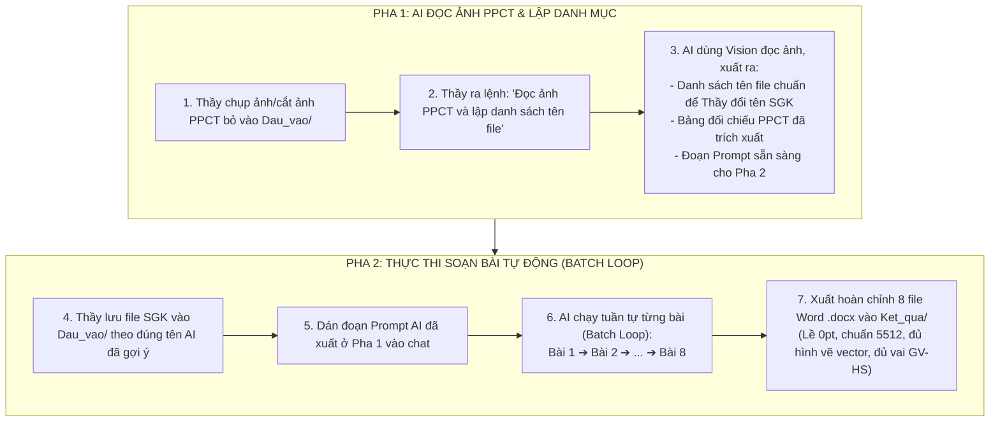

# QUY TRÌNH SOẠN GIÁO ÁN (KHBD) HÀNG LOẠT 2 PHA THÔNG MINH
**Chuẩn Công văn 5512/BGDĐT-GDTrH • Khung Năng lực Số (TT 02/2025) • Khung Năng lực AI (QĐ 2422)**
*Tối ưu hóa 100% công sức cho Giáo viên — Chống soạn nhầm, soạn sai, cắt cụt nội dung*

---

## 💡 Ý TƯỞNG CỐT LÕI: QUY TRÌNH 2 PHA (TWO-PHASE WORKFLOW)

Thay vì Thầy phải tự ngồi gõ bảng PPCT hay tự nghĩ cách đặt tên file sao cho AI hiểu, quy trình được chia làm 2 bước cực kỳ nhàn:



---

## CHI TIẾT CÁC BƯỚC THỰC HIỆN

### 🟢 PHA 1: THẦY NẠP ẢNH PPCT ➔ AI ĐỌC & TẠO DANH SÁCH FILE + PROMPT

1. **Chuẩn bị ảnh PPCT:**
   - Cắt ảnh màn hình hoặc chụp ảnh bảng Phân phối chương trình của tháng/chương (rõ nét các cột: Tuần/Tiết, Tên bài, Số tiết, YCCĐ, Năng lực số / AI nếu có).
   - Đặt file ảnh vào thư mục: `TROLYTHIEN/1_SOAN_KHBD/Dau_vao/` (ví dụ: `PPCT_Thang_10.png` hoặc `PPCT_HocKi1.png`).

2. **Ra lệnh cho AI ở Pha 1:**
   > *"Em hãy đọc kỹ file ảnh PPCT trong thư mục Dau_vao/, trích xuất toàn bộ các bài học trong ảnh và lập cho tôi: (1) Danh sách tên chuẩn để tôi đổi tên các tệp SGK; (2) Bảng đối chiếu PPCT; (3) Đoạn prompt hoàn chỉnh để tôi bấm chạy ở Pha 2."*

3. **Kết quả AI trả về cho Thầy:**
   - **Danh sách tên file Thầy cần đặt:**
     ```text
     01_Toan8_Bai10_TuGiac_Tiet19-20.pdf
     02_Toan8_Bai11_HinhThangCan_Tiet21-22.pdf
     03_Toan8_LuyenTapChung_Tiet23.pdf
     04_Toan8_Bai12_HinhBinhHanh_Tiet24-25.pdf
     05_Toan8_Bai13_HinhChuNhat_Tiet26-27.pdf
     06_Toan8_Bai14_HinhThoiVaVuong_Tiet28-29.pdf
     07_Toan8_LuyenTapChung_Tiet30.pdf
     08_Toan8_BaiTapCuoiChuong3_Tiet31-32.pdf
     ```
   - **Bảng đối chiếu thông tin:** Trích xuất rõ Yêu cầu cần đạt, thời lượng, mã NLS & AI của từng bài để Thầy liếc qua xác nhận.
   - **Đoạn Prompt "đo ni đóng giày":** Được AI viết sẵn riêng cho đúng 8 bài trên.

---

### 🔵 PHA 2: THẦY THẢ FILE SGK ĐÃ ĐỔI TÊN ➔ CHẠY PROMPT SOẠN BÀI

1. **Nạp file SGK:**
   - Thầy copy/đổi tên các file PDF/Word nội dung bài học SGK theo đúng danh sách tên AI đã cung cấp ở Pha 1.
   - Thả toàn bộ vào `TROLYTHIEN/1_SOAN_KHBD/Dau_vao/`.

2. **Ra lệnh chạy (Dán Prompt của Pha 1):**
   ```text
   Tôi đã nạp đủ các file SGK từ 01 đến 08 vào thư mục Dau_vao/ theo đúng danh sách.
   Hãy kích hoạt quy trình soạn giáo án chuẩn Công văn 5512 V2.0 theo vòng lặp tuần tự (Batch Loop):
   1. Lần lượt soạn từ bài 01 đến bài 08.
   2. Mỗi bài đọc đúng file SGK và thông tin PPCT đã phân tích ở Pha 1.
   3. Soạn đầy đủ bảng 2 cột phân vai GV - HS, căn lề 0pt.
   4. BẮT BUỘC IN ĐẬM, IN NGHIÊNG toàn bộ phần nội dung, mã chỉ báo tích hợp Năng lực số, Năng lực AI trong các hoạt động dạy học.
   5. Xuất thành phẩm file Word vào Ket_qua/ theo tên: KHBD_[SốTT]_[TênBài].docx thông qua engine export_khbd_engine.js.
   6. Báo cáo hoàn thành từng bài trước khi tự động làm bài tiếp theo.
   ```

3. **Nhận kết quả tại:**
   - Thư mục: `TROLYTHIEN/1_SOAN_KHBD/Ket_qua/`
   - Đủ 8 file Word hoàn chỉnh, sẵn sàng nộp hoặc in dùng.

---

## 🎯 VÌ SAO QUY TRÌNH NÀY CHỐNG SAI SÓT TUYỆT ĐỐI?

| Rủi ro thường gặp | Quy trình 2 pha khắc phục thế nào? |
| :--- | :--- |
| **Soạn nhầm bài / lộn xộn tiết** | AI đọc ảnh PPCT trước, chốt danh sách và gán số thứ tự cố định `01_` đến `08_`. Không thể nhảy cóc. |
| **Gán sai mã NLS / AI** | AI đã trích xuất trực tiếp mã từ ảnh PPCT ở Pha 1 và lưu vào bộ nhớ, không bịa mã mới. |
| **Bài bị tóm tắt, cắt cụt** | Chạy cơ chế Batch Loop (lần lượt từng bài riêng biệt), mỗi bài có trọn vẹn context và token để đạt độ dài chuẩn 5 – 8 trang Word. |
| **Lỗi định dạng Word, vỡ bảng** | Tự động sử dụng engine `export_khbd_engine.js` đã được tinh chỉnh lề ô 0pt, font chữ chuẩn, hình vẽ toán học sắc nét. |
