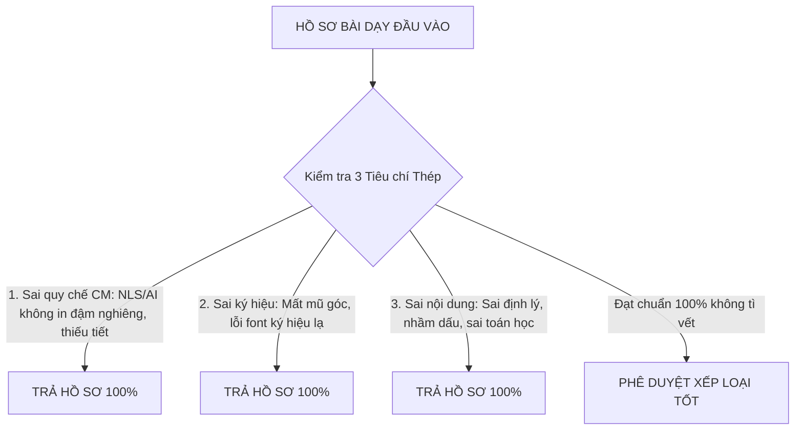

# HƯỚNG DẪN DUYỆT GIÁO ÁN (KIỂM TRA HỒ SƠ CHUYÊN MÔN)
**Phiên bản: VERSION 2.0.0 (BẢN VÁ KỶ LUẬT CHUYÊN MÔN & ZERO TOLERANCE)**  
*Áp dụng: Công văn 5512/BGDĐT-GDTrH, Nghị định 30/2020/NĐ-CP và Quy chế chuyên môn Trường THCS Trần Phú*

---

## 1. NGUYÊN TẮC THÉP TRẢ HỒ SƠ (ZERO TOLERANCE CRITERIA)

Tổ trưởng chuyên môn và Trợ lý Sư phạm thống nhất áp dụng **3 NGUYÊN TẮC THÉP BẮT BUỘC TRẢ HỒ SƠ 100%**:

### 🔴 TIÊU CHÍ 1: SAI QUY CHẾ CHUYÊN MÔN $\rightarrow$ TRẢ HỒ SƠ 100%
1. **Hình thức tích hợp NLS / AI / STEM**:
   - Quy định bắt buộc: Toàn bộ câu mô tả chỉ báo hành động trong Kế hoạch bài dạy phải được **IN ĐẬM, NGHIÊNG** (`bold italic`).
   - **Xử lý vi phạm**: Nếu giáo viên chỉ bôi màu đỏ, chỉ in hoa, hoặc để chữ thường đứng mà **KHÔNG IN ĐẬM, KHÔNG IN NGHIÊNG** $\rightarrow$ **TRẢ HỒ SƠ NGAY LẬP TỨC! TUYỆT ĐỐI KHÔNG DUYỆT (KỂ CẢ DUYỆT KHÁ)**.
2. **Nội dung tích hợp**:
   - Mã năng lực và câu mô tả hành động không khớp 1-1 với Phụ lục 3 đã được BGH phê duyệt $\rightarrow$ **TRẢ HỒ SƠ**.
3. **Tiến độ thực hiện chương trình**:
   - Thiếu tiết theo phân phối chương trình của tháng mà không có giải trình chính đáng được Tổ trưởng chấp thuận $\rightarrow$ **TRẢ HỒ SƠ**.
4. **Header & Footer**:
   - Thiếu Header trường/GV hoặc Footer phân môn/trang/năm học $\rightarrow$ Yêu cầu đính chính dứt điểm.

---

### 🔴 TIÊU CHÍ 2: SAI CÔNG THỨC VÀ KÝ HIỆU TOÁN HỌC $\rightarrow$ TRẢ HỒ SƠ 100%
1. **Ký hiệu góc**:
   - Viết trần chữ cái in hoa ($A, B, C, D, H, E...$) không có dấu mũ góc $\rightarrow$ **TRẢ HỒ SƠ**.
2. **Lỗi font công thức MathType / Equation**:
   - Biến dạng thành dấu chấm trên đầu chữ cái: $\dot{x}Oz, \dot{y}Oz, \dot{m}By, \dot{x}AB, \dot{M}NQ...$
   - Biến dạng đè ký tự rác vuông hoặc dấu perpendicular lên đỉnh: $D^\bot, A^\bot, B^\bot, C^\bot, H^\bot, E^\bot...$
   - Ký tự font micro: $\mu A...$
   $\Rightarrow$ **PHÁT HIỆN BẤT KỲ LỖI NÀO LẬP TỨC TRẢ HỒ SƠ 100%**.
3. **Biến dạng công thức**:
   - Lỗi font phân số, căn thức, lũy thừa, ký hiệu tập hợp biến dạng rác $\rightarrow$ **TRẢ HỒ SƠ**.

---

### 🔴 TIÊU CHÍ 3: SAI VỀ NỘI DUNG CHUYÊN MÔN $\rightarrow$ TRẢ HỒ SƠ 100%
1. **Sai định lý toán học**:
   - Nhầm lẫn bản chất định lý (ví dụ: viết nhầm dấu trừ trong định lý tổng các góc trong tứ giác $\widehat{H} + \widehat{E} + \widehat{F} - \widehat{G} = 360^\circ$)... $\rightarrow$ **TRẢ HỒ SƠ**.
2. **Sai quy tắc biến đổi đại số**:
   - Sai quy tắc chuyển vế, sai quy tắc dấu ngoặc, sai thứ tự thực hiện phép tính $\rightarrow$ **TRẢ HỒ SƠ**.
3. **Sai kiến thức chuyên môn**:
   - Sai kết quả bài toán, sai hình vẽ minh họa $\rightarrow$ **TRẢ HỒ SƠ**.

---

## 2. CHUẨN HÓA THỂ THỨC VĂN BẢN ĐẦU RA (NGHỊ ĐỊNH 30/2020/NĐ-CP)

Toàn bộ tài liệu xuất bản trong thư mục `TROLYTHIEN/3_DUYET_GIAO_AN/Ket_qua/` bắt buộc tuân thủ 100%:
1. **Phông chữ**: `Times New Roman`, bảng mã Unicode.
2. **Cỡ chữ nội dung**: **ĐỒNG NHẤT 13pt** (Không để xen lẫn 10.5pt, 11pt, 12pt ở phần văn bản nội dung).
3. **Thụt đầu dòng**: **BẮT BUỘC 1,27 cm (0.5 inch)** (`first_line_indent = Inches(0.5)`) cho tất cả các đoạn văn, điểm, khoản.
4. **Căn lề & Dãn dòng**: Căn đều hai bên (`JUSTIFY`), dãn dòng cố định **1.2 line**, `space_before = 2pt`, `space_after = 2 - 3pt`.
5. **Định lề trang A4**:
   - Lề trên (Top): `20 mm` (0.79 inch)
   - Lề dưới (Bottom): `20 mm` (0.79 inch)
   - Lề trái (Left): `30 mm` (1.18 inch)
   - Lề phải (Right): `15 mm` (0.59 inch)
6. **Bảng biểu**:
   - Đóng khung kín 4 cạnh viền ngoài và các đường chia ô bên trong (`val="single"`, `sz="4"`, màu đen `000000`).
   - Cỡ chữ trong bảng: `10.5pt`.
7. **Khung nhận diện kết luận (Callout)**:
   - **DUYỆT**: Viền trái màu xanh lá `#16A34A`, nền `#F0FDF4`.
   - **TRẢ HỒ SƠ**: Viền trái màu đỏ tươi `#DC2626`, nền `#FEF2F2`.

---

## 3. BA NHÓM TÀI LIỆU ĐẦU RA BẮT BUỘC

1. **Biên bản kiểm tra hồ sơ Tổ chuyên môn** (`Bien_Ban_Kiem_Tra_Ho_So_To_Toan_Thang_[X].docx` & `.md`):
   - Lưu trữ hồ sơ thanh tra chuyên môn, báo cáo BGH.
   - Bảng III tổng hợp toàn tổ và Mục IV đánh giá chi tiết từng giáo viên.
2. **Tài liệu nộp hệ thống trực tuyến** (`Cap_Nhat_He_Thong_Duyet_Giao_An_Thang_[X].docx` & `.md`):
   - Chuyên dụng để Tổ trưởng Copy & Paste vào phần mềm vnEdu, SMAS, K12Online.
   - Chia rõ từng phân môn và gói nộp chung.
3. **Phiếu nhận xét cá nhân** (`Phieu_Nhan_Xet_Ho_So_[TenGV]_Thang_[X].docx`):
   - Số hiệu: `[STT]/PĐG-TT`.
   - Gửi trực tiếp cho từng giáo viên để nắm rõ ưu điểm và các lỗi bắt buộc phải khắc phục.
