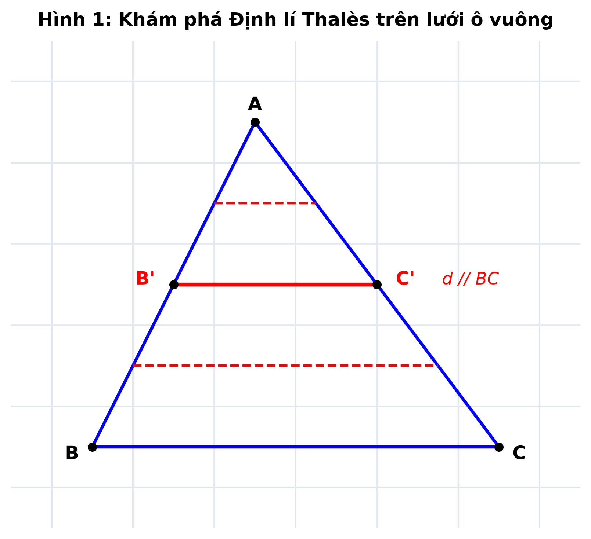
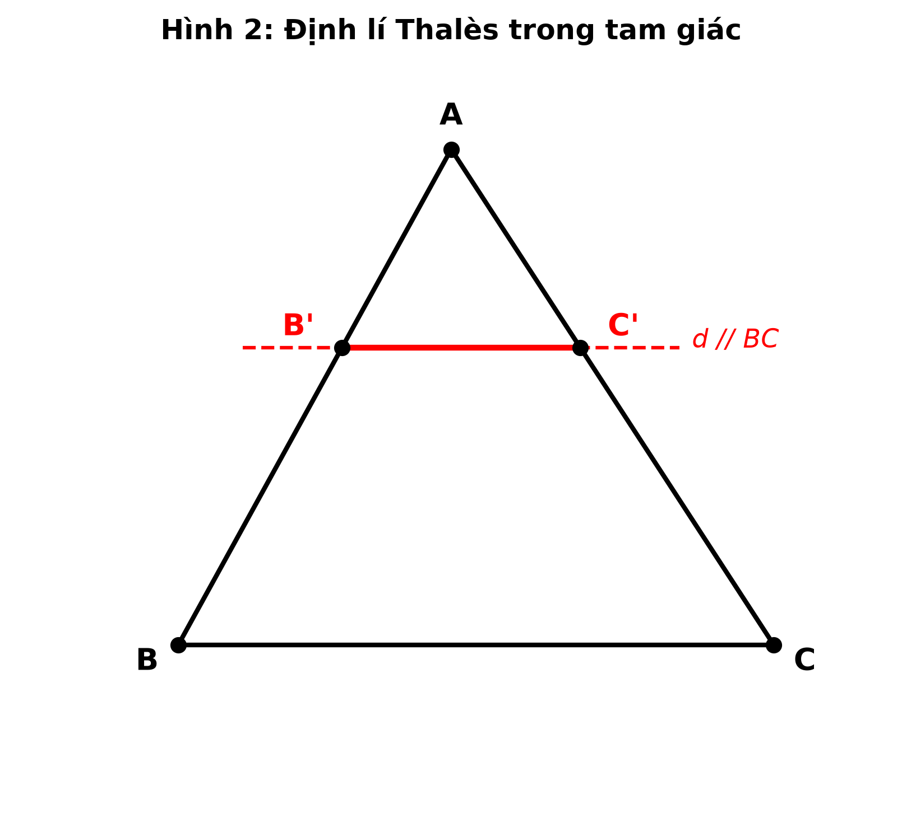
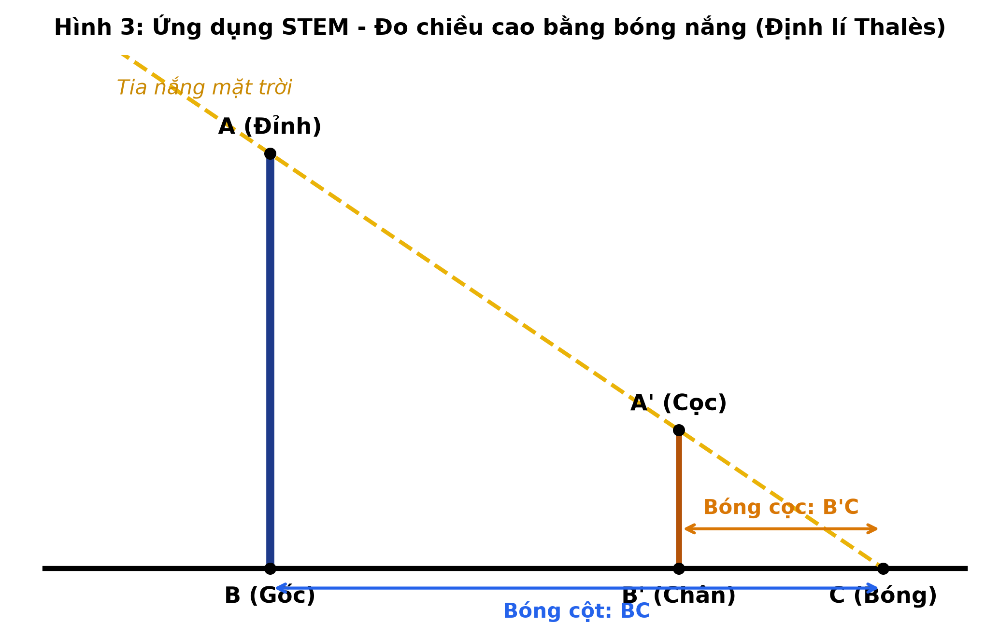

# BÀI 15: ĐỊNH LÍ THALÈS TRONG TAM GIÁC (KHBD STEM)
### Thời lượng thực hiện: 03 tiết (Tiết 16, 17, 18 - Tuần 8, 9 theo PPCT Phụ lục 3)
*(Tiết 16 dạy minh họa NCBH vào Tuần 8 - Cuối tháng 10; Tiết 17, 18 vận dụng vào Tuần 9 - Đầu tháng 11)*

> **THÔNG TIN CHUYÊN ĐỀ NCBH (3 TIẾT - TUẦN 8 & 9):**  
> Thiết kế trọn vẹn chuỗi 3 tiết theo Phụ lục 3 môn Toán 8. Giáo viên dạy minh họa Tiết 16: Thầy Trần Long Hải; Giáo viên đồng thiết kế & dạy đối chứng Tiết 16, 17, 18: Cô Lê Thị Bình; Phê duyệt chuyên môn: Thầy Hoàng Tấn Thiên (Tổ trưởng Toán – Tin). Tích hợp Giáo dục STEM & Khung Năng lực số 5.3.TC2a.

---

## I. MỤC TIÊU DẠY HỌC CHỦ ĐỀ (3 TIẾT)
### 1. Về kiến thức:
- Nắm vững định nghĩa tỉ số của hai đoạn thẳng và các đoạn thẳng tỉ lệ;
- Hiểu, phát biểu chuẩn xác định lí Thalès thuận trong tam giác và viết được giả thiết, kết luận, 3 hệ thức tỉ số tương ứng (Tiết 16);
- Hiểu và phát biểu được định lí Thalès đảo trong tam giác, biết vận dụng để nhận biết và chứng minh hai đường thẳng song song (Tiết 17);
- Vận dụng định lí Thalès và tính chất hình học để giải quyết bài toán thực tế đo bóng nắng, xác định chiều cao vật thể ngoài trời theo phương pháp STEM (Tiết 18).

### 2. Về năng lực:
**a) Năng lực chung:**
- Tự chủ và tự học: Tự giác thực hiện các nhiệm vụ khám phá trên phiếu học tập cá nhân, chủ động nghiên cứu ví dụ trong SGK.
- Giao tiếp và hợp tác: Tương tác tích cực, thảo luận hiệu quả trong nhóm 4 học sinh; biết lắng nghe, phản biện và thống nhất giải pháp.

**b) Năng lực đặc thù môn Toán:**
- Năng lực tư duy và lập luận toán học: So sánh các tỉ số đoạn thẳng trên lưới ô vuông; phát hiện quy luật tỉ lệ bất biến khi đường thẳng song song di chuyển.
- Năng lực mô hình hóa toán học: Chuyển đổi bài toán thực tế đo chiều cao kim tự tháp, đo bóng nắng cây bàng sân trường thành mô hình tam giác có các đường thẳng song song.
- Năng lực giải quyết vấn đề toán học: Lập phương trình tỉ số để tìm ẩn số độ dài x, y của các cạnh trong tam giác.

**c) Năng lực số (NLS) & AI:**
- ***(Tích hợp NLS 5.3.TC2a: Học sinh sử dụng và quan sát phần mềm hình học động GeoGebra để trực quan hóa việc thay đổi vị trí điểm, kiểm chứng các cặp đoạn thẳng tỉ lệ không đổi khi đường thẳng song song với cạnh đáy tam giác)***.

**d) Năng lực STEM:**
- Thiết kế phương án và thực hành phương pháp đo gián tiếp chiều cao vật thể thông qua bóng nắng mặt trời.

### 3. Về phẩm chất:
- Chăm chỉ: Tích cực suy nghĩ, cẩn thận trong đo đạc và tính toán tỉ số.
- Trách nhiệm: Nghiêm túc hoàn thành nhiệm vụ được nhóm phân công, có tinh thần tương trợ bạn học còn thao tác chậm.
- Trung thực: Tôn trọng kết quả đo đạc thực tế ngoài trời, không gán ghép số liệu giả tạo.

---

## II. THIẾT BỊ DẠY HỌC VÀ HỌC LIỆU
1. **Giáo viên:**
- Màn hình tương tác / Tivi thông minh kết nối máy tính;
- Phần mềm GeoGebra với tệp mô phỏng định lí Thalès động;
- 08 bộ Phiếu học tập số 1, số 2, số 3 in sẵn khổ A3, bút lông dạ nhiều màu;
- Mô hình cọc đo bóng nắng, thước dây 10m phục vụ tình huống STEM ngoài trời.
2. **Học sinh:**
- Sách giáo khoa Toán 8 Tập 1 (Kết nối tri thức với cuộc sống);
- Thước thẳng chia milimét, êke, compa, bút dạ, bảng phụ nhóm.

---

## III. TIẾN TRÌNH DẠY HỌC TIẾT 16 (DẠY MINH HỌA NCBH - TUẦN 8, CUỐI THÁNG 10)

### A. HOẠT ĐỘNG 1: KHỞI ĐỘNG (6 phút)

| HOẠT ĐỘNG CỦA GV VÀ HS | SẢN PHẨM DỰ KIẾN |
| :--- | :--- |
| **+ Bước 1: Chuyển giao nhiệm vụ:** - **GV:** Chiếu hình ảnh Kim tự tháp Kheops Ai Cập và kể mẩu chuyện lịch sử: Cách đây hơn 2600 năm, nhà bác học Hy Lạp Thalès đã đo chính xác chiều cao kỳ vĩ của kim tự tháp mà không cần trèo lên đỉnh, chỉ bằng một chiếc cọc nhỏ cắm trên cát và bóng nắng mặt trời. - **GV:** Đặt câu hỏi kích thích tư duy: "Làm thế nào chỉ với bóng nắng và một chiếc cọc, Thalès có thể tính ra chiều cao kim tự tháp? Nguyên lý toán học nào ẩn sau điều kỳ diệu đó?" **+ Bước 2: Thực hiện nhiệm vụ:** - **HS:** Quan sát tranh ảnh trên màn hình, suy nghĩ, trao đổi nhanh theo cặp đôi bàn. **+ Bước 3: Báo cáo, thảo luận:** - **GV:** Mời đại diện 2 học sinh chia sẻ phán đoán. - **HS:** Trả lời phỏng đoán: "Em nghĩ Thalès đã so sánh bóng của chiếc cọc với bóng của kim tự tháp; khi bóng cọc bằng chiều cao cọc thì bóng kim tự tháp cũng bằng chiều cao kim tự tháp." **+ Bước 4: Kết luận, nhận định:** - **GV:** Khen ngợi trực giác toán học xuất sắc của HS và dẫn dắt vào bài mới. | **1. Tình huống thực tế:** - Đo chiều cao kim tự tháp thông qua bóng nắng mặt trời. **2. Dự đoán của học sinh:** - Có mối liên hệ tỉ lệ giữa chiều cao vật thể và chiều dài bóng của nó dưới ánh nắng mặt trời. - Tia nắng mặt trời chiếu song song tạo ra các đoạn thẳng tỉ lệ tương ứng. **3. Tâm thế học tập:** - Học sinh hào hứng, mong muốn tìm hiểu bản chất toán học của Định lí Thalès. |

### B. HOẠT ĐỘNG 2: HÌNH THÀNH KIẾN THỨC MỚI (22 phút)

#### 2.1. Đoạn thẳng tỉ lệ (10 phút)

| HOẠT ĐỘNG CỦA GV VÀ HS | SẢN PHẨM DỰ KIẾN |
| :--- | :--- |
| **+ Bước 1: Chuyển giao nhiệm vụ:** - **GV:** Phát Phiếu học tập số 1. Yêu cầu HS quan sát các đoạn thẳng trên lưới ô vuông và tính tỉ số: $AB = 2\text{ cm}, CD = 4\text{ cm}; A'B' = 3\text{ cm}, C'D' = 6\text{ cm}$. - **GV:** Yêu cầu so sánh tỉ số $AB/CD$ và $A'B'/C'D'$. **+ Bước 2: Thực hiện nhiệm vụ:** - **HS:** Làm việc cá nhân 3 phút, sau đó kiểm tra chéo đáp án với bạn cùng bàn. - **GV:** Quan sát lớp, hướng dẫn học sinh còn lúng túng khi rút gọn phân số. **+ Bước 3: Báo cáo, thảo luận:** - **HS:** Đứng tại chỗ phát biểu: $AB/CD = 2/4 = 1/2; A'B'/C'D' = 3/6 = 1/2$. Suy ra $AB/CD = A'B'/C'D'$. **+ Bước 4: Kết luận, nhận định:** - **GV:** Chốt kiến thức về tỉ số đoạn thẳng và đoạn thẳng tỉ lệ. | **1. Tỉ số của hai đoạn thẳng:** - Tỉ số của hai đoạn thẳng $AB$ và $CD$ là tỉ số độ dài của chúng theo cùng một đơn vị đo, kí hiệu là $\frac{AB}{CD}$. - Chú ý: Tỉ số của hai đoạn thẳng không phụ thuộc vào đơn vị đo (miễn là cùng đơn vị). **2. Đoạn thẳng tỉ lệ:** - Hai đoạn thẳng $AB$ và $CD$ gọi là tỉ lệ với hai đoạn thẳng $A'B'$ và $C'D'$ nếu có tỉ lệ thức: $$\frac{AB}{CD} = \frac{A'B'}{C'D'} \quad \text{hay} \quad \frac{AB}{A'B'} = \frac{CD}{C'D'}$$. |

#### 2.2. Định lí Thalès trong tam giác (12 phút)

| HOẠT ĐỘNG CỦA GV VÀ HS | SẢN PHẨM DỰ KIẾN |
| :--- | :--- |
| **+ Bước 1: Chuyển giao nhiệm vụ:** - **GV:** Chiếu Hình 1 lên màn hình và phát lệnh hoạt động nhóm 4 học sinh: 1) Đếm số ô để tính tỉ số $AB'/AB$ và $AC'/AC$; 2) Tính tỉ số $AB'/B'B$ và $AC'/C'C$; 3) So sánh các cặp tỉ số trên và rút ra nhận xét khi $d // BC$. - ***(Tích hợp NLS 5.3.TC2a: GV mở tệp GeoGebra, gọi 1 đại diện HS lên bảng chạm kéo di chuyển điểm A và điểm B' để cả lớp quan sát các giá trị tỉ số trên bảng dữ liệu tự động nhảy nhưng luôn giữ nguyên dấu bằng)***. **+ Bước 2: Thực hiện nhiệm vụ:** - **HS:** Thảo luận nhóm, ghi kết quả vào Phiếu học tập số 1. - **GV:** Theo dõi các nhóm, hỗ trợ Nhóm 3 khi học sinh viết nhầm thứ tự đoạn thẳng. **+ Bước 3: Báo cáo, thảo luận:** - **HS:** Đại diện Nhóm 1 dán bảng phụ và thuyết trình. - **HS:** Cả lớp quan sát GeoGebra và đồng thanh xác nhận định lý luôn đúng. **+ Bước 4: Kết luận, nhận định:** - **GV:** Chuẩn hóa và phát biểu Định lí Thalès thuận. | **1. Định lí Thalès (thuận):** Nếu một đường thẳng song song với một cạnh của tam giác và cắt hai cạnh còn lại thì nó định ra trên hai cạnh đó những đoạn thẳng tương ứng tỉ lệ. **2. Giả thiết & Kết luận:** - **GT:** $\Delta ABC, d // BC$ ($B' \in AB, C' \in AC$). - **KL:** $$\frac{AB'}{AB} = \frac{AC'}{AC}$$; $$\frac{AB'}{B'B} = \frac{AC'}{C'C}$$; $$\frac{B'B}{AB} = \frac{C'C}{AC}$$. **3. Lưu ý sư phạm:** - Các cặp đoạn thẳng phải viết đúng vị trí TƯƠNG ỨNG. |

### C. HOẠT ĐỘNG 3: LUYỆN TẬP (12 phút)

| HOẠT ĐỘNG CỦA GV VÀ HS | SẢN PHẨM DỰ KIẾN |
| :--- | :--- |
| **+ Bước 1: Chuyển giao nhiệm vụ:** - **GV:** Giao bài tập trên Phiếu học tập số 2: Bài 1: Cho $\Delta ABC$, $MN // BC$ ($M \in AB, N \in AC$). Biết $AM = 4\text{ cm}, MB = 2\text{ cm}, AN = 6\text{ cm}$. Tính độ dài $x = NC$. Bài 2: Cho $\Delta DEF$, $HK // EF$ ($H \in DE, K \in DF$). Biết $DH = 3\text{ cm}, DE = 7.5\text{ cm}, DF = 10\text{ cm}$. Tính độ dài $y = KF$. **+ Bước 2: Thực hiện nhiệm vụ:** - **HS:** Làm việc cá nhân 5 phút. 2 học sinh lên bảng trình bày. - **GV:** Quan sát, phát hiện học sinh nhầm giữa $DH/HE$ và $DH/DE$ để gợi ý điều chỉnh. **+ Bước 3: Báo cáo, thảo luận:** - **HS:** Hai học sinh trên bảng giải chi tiết và giải thích căn cứ áp dụng định lí Thalès. - **HS:** Các học sinh dưới lớp nhận xét, đối chiếu bài làm. **+ Bước 4: Kết luận, nhận định:** - **GV:** Chốt lời giải chuẩn mực, nhấn mạnh cách trình bày hình học logic. | **Bài 1: Tính $x = NC$** - Vì $MN // BC$, theo định lí Thalès ta có: $$\frac{AM}{MB} = \frac{AN}{NC} \Rightarrow \frac{4}{2} = \frac{6}{x} \Rightarrow x = \frac{2 \cdot 6}{4} = 3\text{ (cm)}.$$ Vậy $NC = 3\text{ cm}$.  **Bài 2: Tính $y = KF$** - Ta có: $HE = DE - DH = 7.5 - 3 = 4.5\text{ (cm)}$. - Vì $HK // EF$, theo định lí Thalès ta có: $$\frac{DH}{DE} = \frac{DK}{DF} \Rightarrow DK = \frac{DH \cdot DF}{DE} = \frac{3 \cdot 10}{7.5} = 4\text{ (cm)}.$$ $$\Rightarrow y = KF = DF - DK = 10 - 4 = 6\text{ (cm)}.$$ Vậy $y = 6\text{ cm}$. |

### D. HOẠT ĐỘNG 4: VẬN DỤNG & STEM (5 phút)

| HOẠT ĐỘNG CỦA GV VÀ HS | SẢN PHẨM DỰ KIẾN |
| :--- | :--- |
| **+ Bước 1: Chuyển giao nhiệm vụ:** - **GV:** Chiếu Hình 3 bài toán STEM bóng nắng Thalès và giao bài tập thực tế: "Để đo chiều cao cây bàng ở sân trường THCS Trần Phú, một bạn học sinh cắm một chiếc cọc $A'B'$ cao 1.4 m vuông góc với mặt đất. Tại cùng thời điểm nắng, bóng của cọc trên mặt đất là $B'C = 2\text{ m}$, bóng của cây bàng là $BC = 6\text{ m}$. Hỏi cây bàng cao bao nhiêu mét?" **+ Bước 2: Thực hiện nhiệm vụ:** - **HS:** Hoạt động nhóm bàn nhanh, phác thảo tam giác ABC và cọc $A'B' // AB$. **+ Bước 3: Báo cáo, thảo luận:** - **HS:** Đại diện 1 học sinh giải miệng: "Vì cọc và cây đều vuông góc mặt đất nên $A'B' // AB$. Theo định lí Thalès: $AB / A'B' = BC / B'C \Rightarrow AB / 1.4 = 6 / 2 = 3 \Rightarrow AB = 1.4 \cdot 3 = 4.2\text{ m}$!" **+ Bước 4: Kết luận, nhận định & Dặn dò:** - **GV:** Khẳng định lời giải chính xác, giải thích đó chính là cách Thalès đo kim tự tháp. - **Dặn dò về nhà chuẩn bị cho Tiết 17, 18:** Làm bài tập 4.1, 4.2; chuẩn bị thước dây để Tiết 18 thực hành đo bóng nắng ngoài sân trường. | **1. Lời giải bài toán STEM bóng nắng:** - Vì cây bàng $AB$ và cọc $A'B'$ cùng vuông góc với mặt đất nên $A'B' // AB$. - Xét $\Delta ABC$ có $A'B' // AB$, theo định lí Thalès ta có: $$\frac{AB}{A'B'} = \frac{BC}{B'C} \Rightarrow \frac{AB}{1.4} = \frac{6}{2} \Rightarrow AB = \frac{1.4 \cdot 6}{2} = 4.2\text{ (m)}.$$ Vậy cây bàng sân trường cao 4.2 mét.  **2. Hướng dẫn tự học:** - Nắm vững điều kiện áp dụng: Bắt buộc phải có yếu tố SONG SONG. |

---

## IV. TÓM TẮT TIẾN TRÌNH TIẾT 17 VÀ TIẾT 18 (VẬN DỤNG VÀO TUẦN 9 - ĐẦU THÁNG 11)

### 1. TIẾT 17: ĐỊNH LÍ THALÈS ĐẢO TRONG TAM GIÁC
- **Mục tiêu:** Học sinh phát biểu được định lí Thalès đảo; biết chứng minh hai đường thẳng song song dựa vào các đoạn thẳng tỉ lệ.
- **Tiến trình tổ chức:** Khởi động kiểm tra bài cũ (4 phút) -> Khám phá Định lí đảo qua hình vẽ đối chứng (15 phút) -> Luyện tập chứng minh song song và nhận biết hình thang (18 phút) -> Vận dụng củng cố (8 phút).

### 2. TIẾT 18: LUYỆN TẬP VÀ HOẠT ĐỘNG THỰC HÀNH STEM NGOÀI TRỜI (TUẦN 9 - ĐẦU THÁNG 11)
- **Mục tiêu:** Học sinh vận dụng tổng hợp định lí Thalès thuận, đảo; sử dụng thước dây và cọc tiêu để đo chiều cao cột cờ, cây bàng sân trường THCS Trần Phú.
- **Tiến trình tổ chức:**
  + Hoạt động 1: Ôn tập hệ thống hóa kiến thức 2 định lí bằng Sơ đồ tư duy Mindmap (10 phút).
  + Hoạt động 2: Phân chia 4 nhóm ra sân trường thực hành đo bóng nắng và góc nghiêng (20 phút).
  + Hoạt động 3: Báo cáo số liệu đo đạc, tính toán chiều cao vật thể và đánh giá sai số giữa các nhóm (15 phút).

---

## V. PHỤ LỤC HỌC LIỆU VÀ RUBRIC ĐÁNH GIÁ (3 TIẾT)

| Tiêu chí đánh giá | Mức 1 (Chưa đạt) | Mức 2 (Đạt) | Mức 3 (Tốt) |
| :--- | :--- | :--- | :--- |
| **1. Khám phá & Phát biểu định lý (Tiết 16, 17)** | Chưa đếm đúng ô lưới, chưa lập được tỉ số tương ứng. | Đếm đúng ô lưới, lập được tỉ số và phát biểu được định lý. | Thao tác thành thạo, phát biểu chuẩn xác, tương tác tự tin với mô phỏng GeoGebra. |
| **2. Kỹ năng tính toán & Chứng minh** | Viết sai tỉ lệ thức hoặc nhầm lẫn giữa các cạnh. | Viết đúng tỉ lệ thức, thay số tính đúng ẩn số ở bài cơ bản. | Giải nhanh, trình bày chuẩn mực hình học, giải quyết tốt bài toán có tam giác xoay hướng. |
| **3. Tinh thần hợp tác & Thực hành STEM (Tiết 18)** | Thụ động, dựa dẫm vào các bạn trong nhóm. | Tham gia thảo luận nhóm, ghi chép đầy đủ vào phiếu đo thực tế. | Chủ động điều phối nhóm, thao tác đo bóng nắng chuẩn xác, báo cáo số liệu sáng tạo. |

---

| GIÁO VIÊN SOẠN BÀI | TỔ TRƯỞNG CHUYÊN MÔN DUYỆT |
| :---: | :---: |
| *(Ký, ghi rõ họ tên)*    **Trần Long Hải - Lê Thị Bình** | *(Ký, ghi rõ họ tên)*    **Hoàng Tấn Thiên** |
