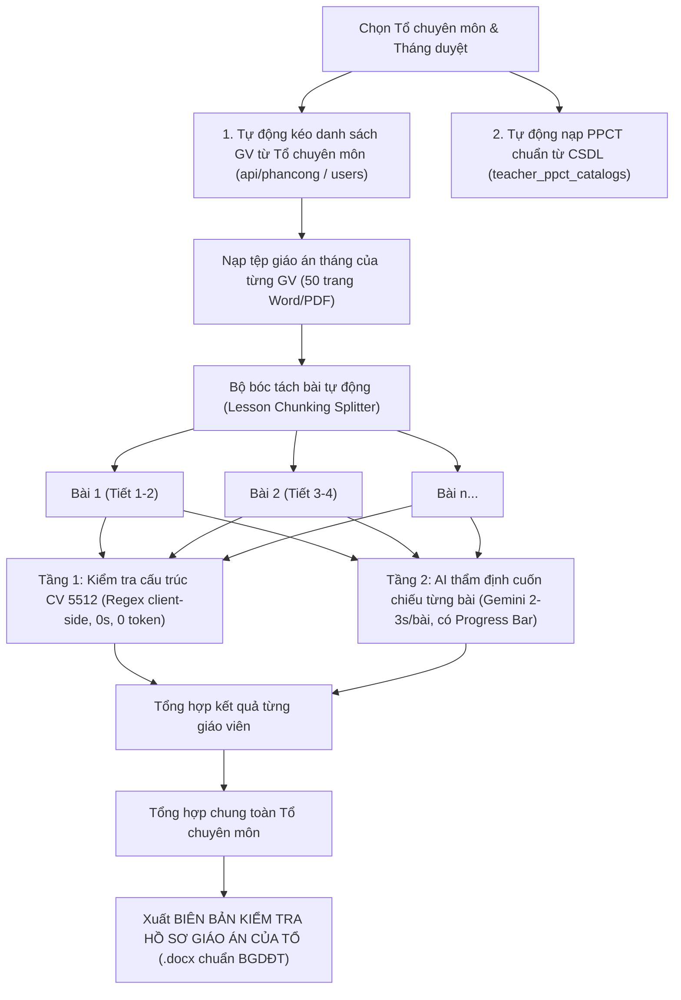

# PLAN: Nâng Cấp Hệ Thống Thẩm Định & Duyệt Giáo Án Theo Tổ Chuyên Môn (CV 5512)

## 1. Vấn Đề Thực Tế & Yêu Cầu Người Dùng

1. **Giáo án 1 tháng (50+ trang) bị quá tải / nghẽn API:**
   - Code cũ dùng `String(teacher.lessonText||'').slice(0, 18000)`, chỉ lấy ~5-6 trang đầu, bỏ sót >85% nội dung còn lại.
   - Gửi nguyên khối 50 trang một lúc khiến AI timeout, vượt hạn mức token trả về và làm hỏng JSON (`JSON.parse` fail) dẫn đến fallback về kết quả heuristic sơ sài.
2. **PPCT đã có sẵn trong CSDL:**
   - Hệ thống đã có bảng CSDL `teacher_ppct_catalogs` (lưu trữ theo môn, khối lớp, năm học, trường).
   - Không bắt Tổ trưởng / BGH phải tìm và tải tệp PPCT lên thủ công mỗi lần duyệt; hệ thống cần **tự động liên kết và nạp PPCT từ CSDL**.
3. **Giáo viên có sẵn theo Tổ chuyên môn:**
   - Hệ thống đã có dữ liệu phân công giảng dạy (`phancong_chuyenmon` và `users`).
   - Cần tính năng **tự động nạp danh sách giáo viên của tổ chuyên môn** (kèm môn, khối lớp được phân công), không bắt gõ tay từng người.
4. **Biên bản duyệt tổng hợp chung cho cả tổ:**
   - Thay vì chỉ xuất phiếu nhận xét rời rạc từng cá nhân, hệ thống cần xuất **Biên bản kiểm tra hồ sơ giáo án của Tổ chuyên môn** (.docx) chuẩn thể thức văn bản quản lý giáo dục: có bảng tổng hợp xếp loại toàn tổ, đánh giá ưu/nhược điểm chung, kiến nghị tháng tới và nơi ký duyệt của Tổ trưởng + Ban Giám hiệu.

---

## 2. Thiết Kế Kiến Trúc & Luồng Xử Lý (Workflow)

---

## 3. Chi Tiết Kỹ Thuật Cho Coder

### A. Backend (`api/duyetgiaoan.php`)
1. **Bổ sung API lấy danh sách giáo viên theo tổ chuyên môn (`action=get_department_teachers`)**:
   - Đọc từ `phancong_chuyenmon` (kế hoạch phân công mới nhất) hoặc từ bảng `users` (`role = 'teacher'`).
   - Trả về danh sách GV kèm môn phụ trách, các khối lớp phân công.
2. **Bổ sung API tự động lấy PPCT từ CSDL (`action=get_ppct_catalog`)**:
   - Query bảng `teacher_ppct_catalogs` theo `subject`, `grade`, `academic_year`, `school_name`.
   - Trả về danh sách bài, số tiết và thứ tự PPCT chuẩn để đối chiếu mà không cần tải file ngoài.
3. **Cập nhật lưu trữ đợt duyệt (`duyet_giao_an_sessions`)**:
   - Lưu trữ `session_data` gồm: danh sách bài đã duyệt của từng giáo viên, điểm số từng bài, xếp loại chung của tổ.

### B. Frontend (`duyetgiaoan.html`)
1. **Bộ tách bài tự động (Lesson Chunking Splitter)**:
   - Viết hàm `splitLessonsFromText(fullText)`:
     - Nhận diện phân cách các bài qua regex: `/(?:KẾ HOẠCH BÀI DẠY|BÀI\s+\d+|TIẾT\s+\d+|I\.\s*MỤC TIÊU)/i`.
     - Chia 50 trang thành danh sách mảng các bài học `{ title, period, text, startIndex }`.
2. **Thẩm định 2 tầng cuốn chiếu (Sequential Batch Processing)**:
   - **Tầng 1 (Heuristic kiểm tra khung)**: Kiểm tra 4 hoạt động CV 5512 (Khởi động, Hình thành kiến thức, Luyện tập, Vận dụng), bảng 2 cột 4 bước (Chuyển giao, Thực hiện, Báo cáo, Kết luận).
   - **Tầng 2 (Gemini Review từng bài)**: Gọi AI phân tích từng bài học nhỏ (~3.000 - 5.000 ký tự). Cập nhật thanh tiến trình:
     `Đang thẩm định GV Nguyễn Văn A - Bài 2: Phép cộng (Tiết 3-4)... [45%]`.
3. **Tự động nạp PPCT và Tổ chuyên môn**:
   - Dropdown chọn Tổ chuyên môn -> Nút **"Đồng bộ GV từ Tổ chuyên môn"** tự động điền danh sách GV.
   - Khi chọn Môn/Khối -> Tự động nạp PPCT tương ứng từ server, báo trạng thái `Đã kết nối PPCT chuẩn (35 tuần, 105 tiết)`.
4. **Biên bản duyệt tổng hợp chung cho cả tổ (`exportDepartmentDocx`)**:
   - Tạo mẫu biên bản hành chính trường học chuẩn bằng thư viện `docx`:
     - **Cơ quan chủ quản & Tên trường** (Góc trái trên).
     - **Quốc hiệu, Tiêu ngữ** (Góc phải trên).
     - Tiêu đề: **BIÊN BẢN KIỂM TRA HỒ SƠ GIÁO ÁN TỔ CHUYÊN MÔN**
     - Đợt kiểm tra: Tháng ... Năm học ...
     - **I. THÀNH PHẦN KIỂM TRA**: Tổ trưởng, Tổ phó, các thành viên.
     - **II. NỘI DUNG & TIÊU CHÍ ĐÁNH GIÁ**:
       1. Thực hiện tiến độ PPCT.
       2. Cấu trúc KHBD theo Công văn 5512/BGDĐT-GDTrH.
       3. Tích hợp Năng lực số (TT 02/2025/TT-BGDĐT) và AI (QĐ 2422/QĐ-BGDĐT).
     - **III. BẢNG TỔNG HỢP KẾT QUẢ ĐÁNH GIÁ TỪNG GIÁO VIÊN**:
       - Bảng cột: STT | Họ và tên GV | Môn - Lớp | Số bài/tiết duyệt | Tiến độ PPCT | CV 5512 | NLS/AI | Xếp loại (Tốt/Khá/Đạt/Chưa đạt).
     - **IV. ĐÁNH GIÁ CHUNG CỦA TỔ CHUYÊN MÔN**:
       - Ưu điểm nổi bật.
       - Tồn tại, hạn chế cần khắc phục.
       - Kiến nghị và kế hoạch điều chỉnh trong tháng kế tiếp.
     - **V. KÝ DUYỆT**: Người lập biên bản (Tổ trưởng CM) & Phê duyệt của Ban Giám hiệu.

---

## 5. Khắc Phục Trích Xuất Hình Vẽ SGK & Tạo Hình Học (`canvas_soankhbd`)

### Vấn đề:
- Khi nạp PDF SGK ở Bước 0, câu lệnh `canvasTextbookAnalysisPrompt` chỉ yêu cầu trích xuất `sections`, `coreKnowledge`, `activities`, `exercises`; **không trích xuất các hình vẽ (figures)**.
- Khi sang bước Tạo ảnh minh họa (`GENERATE_ILLUSTRATIONS`), AI đọc tóm tắt thấy toàn chữ nên trả về `illustrations: []` và hiện toast: *"Bài này không cần hình minh họa (chủ yếu chữ/số)"*, điều này phi lý với bài Hình học.

### Giải pháp kỹ thuật:
1. **Cập nhật `canvasTextbookAnalysisPrompt` trong `js/khbd-app.js`**:
   - Thêm vào schema JSON: `"figures": [{"id": "Hình 1", "description": "mô tả chi tiết hình vẽ trong SGK", "subsection": "mục chứa hình"}]`.
   - Yêu cầu AI quét và liệt kê đầy đủ các hình vẽ, sơ đồ hình học, đồ thị có trong các trang PDF.
2. **Cập nhật `analyzeCanvasTextbookSafely` & `formatCanvasTextbookContext`**:
   - Thu thập `figures` qua các batch và ghi vào ngữ cảnh SGK: `## Hình vẽ trong SGK`.
3. **Cập nhật `GENERATE_ILLUSTRATIONS` trong `js/khbd-prompts.js`**:
   - Đối với môn Toán phân môn Hình học hoặc bài có từ khóa hình học: BẮT BUỘC liệt kê tối thiểu 1–3 hình SGK, cấm trả về rỗng.
4. **Fallback & Toast trong `generateLessonIllustrations`**:
   - Nếu là bài hình học mà AI trả về rỗng, tự động lấy các `figures` trích xuất từ SGK để tạo hình SVG thay vì dừng lại.
   - Không hiển thị toast "không cần tạo hình" cho bài Hình học.
5. **Mở khóa `gemini-2.5-flash-image` trong môi trường Canvas (0đ / Không cần API key)**:
   - Trong `js/khbd-gemini.js` và `canvas_soankhbd.html`: Cho phép `generateImage` hoạt động ở chế độ Canvas trực tiếp (`allowEmptyKey: true` hoặc `isCanvasGeminiRoute()`), không ném lỗi yêu cầu API key cá nhân.
   - Tuyến Canvas gọi thẳng `gemini-2.5-flash-image` qua session trực tiếp của Canvas, tạo ảnh màu thực tế 0 đồng không cần API key.
6. **Khắc phục lỗi vẽ Vector SVG bị chạy một hồi rồi thoát (Timeout / Model treo)**:
   - **Nguyên nhân:** Hàm `generateSvgDrawing` hiện chưa gán mục đích (purpose), khiến Canvas định tuyến lệnh vẽ vào mô hình `gemini-3-flash-preview`. Đây là mô hình suy luận văn bản sâu (thinking model), khi phải tính toán hàng trăm tọa độ XML thì tốn nhiều thời gian và chạm mốc `timeoutMs: 60000` (60 giây), dẫn đến việc bị ngắt giữa chừng và tắt thanh tiến trình.
   - **Giải pháp:**
     + Trong `generateSvgDrawing`: Truyền `{ purpose: 'svg_drawing', timeoutMs: 90000 }`.
     + Trong `canvas_soankhbd.html`: Khi `options.purpose === 'svg_drawing'`, định tuyến thẳng sang **`gemini-2.5-flash`** (mô hình này sinh mã SVG cực nhanh trong 2–3 giây, chính xác và không bị nghẽn suy luận).
     + Cải tiến `extractSvgCode`: Loại bỏ markdown block (\`\`\`xml, \`\`\`svg) và tự động đóng thẻ `</svg>` nếu dữ liệu bị ngắt để tránh lỗi parse.

---

## 6. Khắc Phục Lỗi PPCT & Tự Động Nhảy Tên Trường Khi Đổi Lớp (`soankhbd`)

### Vấn đề:
1. **Lệch năm học làm ẩn PPCT cũ:** Các hồ sơ PPCT cũ (như Lớp 9 ID 2, Lớp 8 ID 8) được nạp từ trước khi có năm học, trong CSDL `academic_year = ''`. Khi người dùng đổi sang Lớp 9, ô Năm học mặc định điền `2026-2027` làm API lọc cứng không thấy, PPCT cũ bị ẩn đi.
2. **Không tự động nhảy tên trường khi đổi khối lớp:** Giáo viên dạy Lớp 8 ở Trường A (THCS Trần Phú), dạy Lớp 6 ở Trường B (THCS Nguyễn Hiền). Khi bấm từ Lớp 8 sang Lớp 6 (hoặc ngược lại), ô Trường vẫn bị giữ nguyên trường cũ, không tự động nhận diện và nhảy sang trường của khối lớp mới. Do đó hệ thống tìm sai trường và báo không có PPCT.

### Giải pháp kỹ thuật:
1. **Tự động chuyển trường khi đổi khối lớp (`selectGrade.change`)**:
   - Khi người dùng đổi `selectGrade`:
     - Tự động gọi `refreshPpctSchoolControls()` để lấy danh sách trường `profiles` của khối lớp mới.
     - Kiểm tra nếu trường hiện tại (`appState.ppctSchool`) không nằm trong danh sách trường của khối lớp mới:
       + Tự động chuyển sang trường đầu tiên có PPCT của khối lớp đó: `await switchPpctSchool(profiles[0].school_name)`.
       + Cập nhật dropdown `ppctSchoolSelect` sang đúng tên trường mới.
       + Tải toàn bộ PPCT tương ứng của trường đó cho khối lớp mới.
     - Kết quả: Chọn Lớp 8 ➡️ tự động nhảy ra Trường A (Trần Phú); Chọn Lớp 6 ➡️ tự động nhảy ra Trường B (Nguyễn Hiền).
2. **Backend (`api/khbd_ppct_catalog.php` & `api/canvas_ppct_catalog.php`)**:
   - Khi truy vấn `profiles`: Bỏ lọc `academic_year`, trả về toàn bộ hồ sơ trường đã có của `owner_user_id`, `subject`, `grade` để không bị ẩn hồ sơ cũ.
   - Khi truy vấn `catalog`: Nếu tìm theo `$year` cụ thể mà không có, tự động fallback tìm bản ghi cũ có `academic_year = ''` (hoặc `AND (academic_year = ? OR academic_year = '')`).
3. **Frontend (`js/khbd-app.js`)**:
   - `loadPpctSchoolProfiles`: Không giới hạn `academic_year` khi lấy danh sách hồ sơ trường, đảm bảo hiển thị cả các hồ sơ cũ `(Chưa đặt năm / Chưa đặt tên)`.

---

## 7. Kế Hoạch Kiểm Thử (Verification Plan)

1. **Duyệt giáo án theo Tổ (`tests/duyetgiaoan-department-smoke.js`)**:
   - Tách bài `splitLessonsFromText` với văn bản mẫu 50 trang Word.
   - Nạp tự động PPCT từ CSDL mà không cần file.
   - Nạp danh sách GV từ tổ chuyên môn.
   - Xuất biên bản DOCX tổng hợp cả tổ có đủ bảng biểu và các mục I, II, III, IV, V.
2. **Tạo hình SGK Canvas (`tests/canvas-geometry-figures-smoke.js`)**:
   - Kiểm tra `canvasTextbookAnalysisPrompt` có trường `figures`.
   - Kiểm tra `formatCanvasTextbookContext` có xuất mục hình vẽ SGK.
   - Kiểm tra bài hình học không bị rơi vào nhánh "không cần tạo hình".
3. **Tự Động Nhảy Trường & Hiển Thị PPCT Khi Đổi Lớp (`tests/ppct-legacy-fallback-smoke.js`)**:
   - Lớp 8 gắn Trường A, Lớp 6 gắn Trường B: Chuyển sang Lớp 8 xác nhận ô Trường tự động nhảy sang A và nạp PPCT của A; chuyển sang Lớp 6 xác nhận ô Trường tự động nhảy sang B và nạp PPCT của B.
   - Gọi API lấy profiles Lớp 9 với `academic_year=2026-2027`: xác nhận hồ sơ ID 2 (năm học rỗng) vẫn được trả về đầy đủ.
4. **Regression Test**:
   - `node tests/duyetgiaoan-smoke.js`
   - `node tests/duyetgiaoan-integration-smoke.js`
   - `node tests/khbd-ppct-multi-school-smoke.js`
   - `git diff --check`
